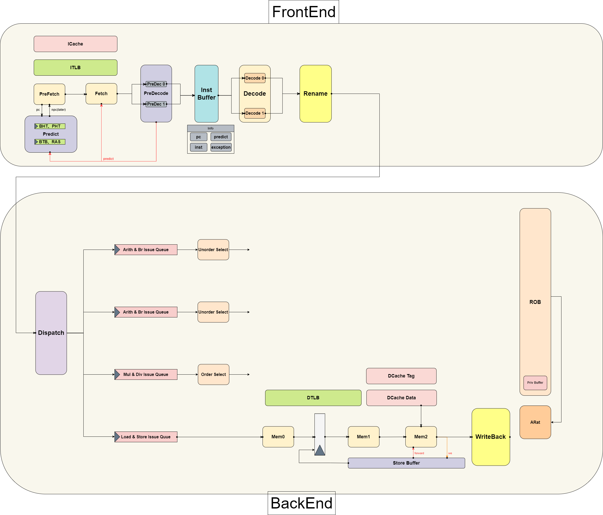

# &#128187;  NoAXI-CPU

### &#11088;你好 &#127773; 这里是一个可爱的基于LA32R指令集CPU 

&#11088;本项目使用基于chisel的scala硬件描述语言，设计了后端四发射乱序处理器。采用前后端设计，前端负责顺序取指，后端负责乱序执行

## 🎨 整体结构图

## 📚 简介
- 支持指令集：龙芯架构32位精简版中的
  - 算数类指令：`ADD.W`, `SUB.W`, `ADDI.W`, `LU12I.W`, `SLT[U]`, `SLT[U]I`, `PCADDU12I`, `AND`, `OR`, `NOR`, `XOR`, `ANDI`, `ORI`, `XORI`, `MUL.W`, `MULH.W[U]`, `DIV.W[U]`, `MOD.W[U]`, `SLL.W`, `SRL.W`, `SRA.W`, `SLLI.W`, `SRLI.W`, `SRAI.W`
  - 跳转指令：`BEQ`, `BNE`, `BLT[U]`, `BGE[U]`, `B`, `BL`, `JIRL`
  - 访存指令：`LD.B`, `LD.H`, `LD.W`, `LD.BU`, `LD.HU`, `ST.B`, `ST.H`, `ST.W`
  - CSR相关指令：`CSRRD`, `CSRWR`, `CSRXCHG`
  - Cache相关指令：`CACOP` (暂未实现)
  - TLB相关指令：`TLBSRCH`, `TLBRD`, `TLBWR`, `TLBFILL`, `INVTLB`
  - 其他杂项指令：`RDCNTVL.W`, `RDCNTVH.W`, `RDCNTID`, `SYSCALL`, `BREAK`, `ERTN`