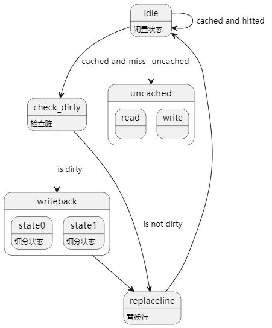

<b>
NSCSCC2024 初赛设计报告
</b>

<b>
杭州电子科技大学 NoAXI队
</b>

<b>
陈润澎 刘文涛
</b>

# 1. 概述

## 1.1 项目简介

本项目是第八届"龙芯杯"全国大学生计算机系统能力培养大赛（NSCSCC 2024）的参赛作品。

本项目为基于龙芯架构32位精简版指令集(LA32R)，开发的一款乱序多发射的CPU。项目基于Tomasulo动态调度算法，使用ROB重排序缓存，实现了一个**乱序执行**、**后端四发射**的CPU，最深级数到达了**13**。此外，我们还实现了分支预测、Cache缓存等诸多特性。我们在官方提供的性能测试框架当中，达到了**0.78**的IPC，I/DCache的命中率均达到了**98.8%**以上，使得CPU取得了良好的性能表现。

## 1.2 处理器总体参数

我们非常关注处理器执行指令的效率，因此，下面将给出我们CPU在执行官方提供的性能测试框架时的相关参数概览。

从下表可以看到，我们的I/D-Cache达到了98%以上的高命中率，优秀的访存维护逻辑使得我们的CPU在访存密集型测试集当中保持了良好的IPC。同时我们的分支命中成功率也达到了91.4%，这使得我们的CPU能够尽可能地避免分支预测失败带来的大量气泡，为我们加深流水级、实现后端乱序执行打下了良好的基础。

| 项目             |   参数    |
| :---:            | :-------: |
| IPC              |   0.78    |
| 频率             |   83hz   |
| 分支预测成功率    |   91.4%   |
| I-Cache命中率    |   99.6%   |
| D-Cache命中率    |   98.8%   |
| 流水级数          |   13     |

## 1.3 实现功能

我们的指令集支持了龙芯架构32位精简版中除了浮点指令以外的所有指令，并支持了指令集中全部CSR寄存器的维护，实现了丰富的指令功能。

- 算数类指令：`ADD.W`, `SUB.W`, `ADDI.W`, `LU12I.W`, `SLT[U]`, `SLT[U]I`, `PCADDU12I`, `AND`, `OR`, `NOR`, `XOR`, `ANDI`, `ORI`, `XORI`, `MUL.W`, `MULH.W[U]`, `DIV.W[U]`, `MOD.W[U]`, `SLL.W`, `SRL.W`, `SRA.W`, `SLLI.W`, `SRLI.W`, `SRAI.W`
- 跳转指令：`BEQ`, `BNE`, `BLT[U]`, `BGE[U]`, `B`, `BL`, `JIRL`
- 访存指令：`LD.B`, `LD.H`, `LD.W`, `LD.BU`, `LD.HU`, `ST.B`, `ST.H`, `ST.W`,`LL`,`SC`
- CSR相关指令：`CSRRD`, `CSRWR`, `CSRXCHG`
- Cache相关指令：`CACOP` 
- TLB相关指令：`TLBSRCH`, `TLBRD`, `TLBWR`, `TLBFILL`, `INVTLB`
- 栅障指令：`IBAR`,`DBAR`
- 其他杂项指令：`RDCNTVL.W`, `RDCNTVH.W`, `RDCNTID`, `SYSCALL`, `BREAK`, `ERTN`

# 2. 处理器微架构设计

## 2.1 整体介绍

NoAXI处理器采取前后端设计，前端共5个流水级，后端共6个流水级，共11个流水级，最深级数为13。

前端五个流水级，分别为 **预取指**、**取指**、**预译码**、**译码**、**重命名**。

后端分为六个流水级，分别为 **分发**、**发射**、**读寄存器**、**执行**、**写回**、**提交**。

其中**执行**级分为并行的四条流水线，分别为：**算术流水线0**、**算术流水线1**、**乘除流水线**、**访存流水线**。

前端采取顺序双发射设计，取指宽度为2，每个周期可以向后端最多传输2条指令。

后端采取乱序四发射设计，流水线条数为4，每个周期可以进行最多2条指令的提交。

## 2.2 前端设计

前端分为 **预取指**（`PreFetch`）、**取指**（`Fetch`）、**预译码**（`PreDecode`）、**译码**（`Decode`）、**重命名**（`Rename`） 共五级。

其中，预译码级与译码级之间，使用了一个指令缓冲（`Instruction Buffer`）进行解耦。

### 2.2.1 预取指 PreFetch

在这一级中进行**pc**的更新，并且将虚地址发送给`TLB`。

1. **pc**发送至`TLB`，`TLB`进行翻译 
   - 若是直接地址翻译或直接地址映射，直接将得到的物理地址传递给`Fetch`级
   - 若是映射地址翻译，给`TLB`表项发地址，得到命中信息并传递给`Fetch`级
2. **pc**发送至`I-Cache`，基于`VIPT`原理，给`I-Cache`索引
3. **pc**发送至`BPU`，进行分支预测(发送按双字对齐的两个**pc**进行预测，如果第二个**pc**不满足双字对齐则不预测)
   - **pc**发送至`BTB`读取信息
   - **pc**发送至`BHT`得到跳转历史，寄存器锁存供下一拍使用
4. 根据情况更新**pc**
   - (最高优先级)后端传来的跳转请求：可能是例外中断造成的跳转，也可能是特权指令需要冲刷流水线，也可能是分支预测失败的重新取指
   - (第二优先级)分支预测传来的跳转请求
   - (第三优先级)更新**pc**为按双字对齐的下一个**pc**，例如 1c001000 $\rightarrow$ 1c001008，1c00110c $\rightarrow$ 1c001110

### 2.2.2 取指 Fetch

为降低硬件复杂度，我们设计了独特的取指方式，选择**双字对齐**方式的**双指令取指**。相较于四指令取指，这样的取指方式降低了因分支预测造成的标记无效指令的硬件开销，并且，效率也不会得到大幅降低，因为我们的`I-Cache`一行存四个指令，大部分正常取指的情况下，两次取指中的第二次是**必定命中**`I-Cache`的，保证了前端取指的高效。

1. 在此级中把命中信息发送至`TLB`，读出命中表项，翻译出**paddr**；并且判断是否存在`TLB`相关例外
2. 将得到的**paddr**发送至`I-Cache`，判定是否命中，若不命中则进入阻塞状态，并与主存利用axi接口交互取出Cache缺失行
3. 取出两条指令，并且保证pc是按双字对齐的，若第二条指令**pc**未满足条件则会标记为无效
4. 得到分支预测的结果
   - 利用上一拍得到的`BTB`信息和`BHT`中读取到的`BHR`，得到预测方向和跳转结果
   - 若预测跳转，清刷`prefetch`并对其发出跳转请求

#### 2.2.2.1 分支预测器 BPU

在乱序处理器当中，因为流水级数深，分支预测失败代价过大。因此，分支预测器很大程度上决定着cpu的**IPC**。  
为降低硬件复杂度，我们同样设计了**两级BPU**，将整个预测过程分为了两拍完成。我们使用了**基于局部历史的饱和计数器分支预测**结合**BTB**和**RAS**对多种分支场景进行了有效的分支预测，下表是性能测试中十个测试点的具体成绩。

| 测试点编号  |  测试点名称       |  无RAS分支预测成功率 |  分支预测成功率|
| :---:      | :-------:        |  :-------:     |  :-------:         |
| 1          |   bitcount       |   80.510 %     |  **94.509 %**      |
| 2          |   bubble_sort    | / |  84.935 %          |
| 3          |   coremark       | / |  88.955 %          |
| 4          |   crc32          |   90.100 %     |  **96.367 %**      |
| 5          |   dhrystone      | / |  95.331 %          |
| 6          |   quick_sort     | / |  74.780 %          |
| 7          |   select_sort    | / |  93.456 %          |
| 8          |   sha            | / |  98.284 %          |
| 9          |   stream_copy    | / |  95.924 %          |
| 10         |   stringsearch   | / |  93.666 %          |

1. `BHT(Branch History Table)`：保存跳转指令的跳转局部历史，在跳转指令提交时更新

2. `PHT(Pattern History Table)`：记录跳转历史对应的饱和计数器值，对应跳转的方向趋势，用于预测跳转方向

3. `BTB(Branch Target Buffer)`：记录**pc**对应的跳转地址，兼顾判断跳转类型(**CALL**,**Return**,其他)的职责
   
   - 适用指令：条件跳转类和**CALL**型指令
   - 用途：记录指令的跳转类型，是否为跳转指令(`valid`位)，跳转地址
   - 仅当`BTB`命中时才可能发生分支预测
   - 表项组织形式如下：
   
   | Valid | Tag             | Target   | Br_type |
   | :---: | :--:            | :--:     | :-----: |
   |  1 b  | (32 - index) b  | 32 b     |   2 b   |

4. `RAS(Return Address Stack)`：以**栈**的形式记录**CALL**指令的下一条指令地址
   - 适用指令：间接跳转**Return**指令
   - 用途：预测**Return**指令的跳转地址(因为函数调用和返回一定满足**栈**的性质)，上表中**加粗**表示的即为`RAS`对函数调用密集型测试点的重大作用
   - `RAS`满时，对`RAS`使用循环更新，即再从底向上开始更新，可以尽可能保证预测准确性

5. 分支预测器不会被flush

#### 2.2.2.2 TLB

考虑到`TLB`的全相连结构，它在被查询时硬件复杂度较高。为此，我们设计了**同步读取**的`TLB`逻辑，无论是前端还是后端的地址翻译，我们均会在第一拍发送虚地址，进行`TLB`表项的查询，同时进行`mmu`的判断，是否为直接地址翻译或直接地址映射，若为`TLB`页表映射，则**锁存**命中信息供下一拍使用；在下一拍同时得到例外有关信息。这样的设计均摊了查询`TLB`表项的复杂度，有效的提高了频率。

### 2.2.3 预译码 PreDecode

为进一步降低分支预测失败造成的影响，我们创造性的在解码之前加入了**预译码**级，在这一级中，我们在力所能及的程度下对分支结果进行**最迅速**的检查，并且在发现错误的**第一时间**通知前端重新取指。

在这一级中会处理以下情况：
1. 必定跳转指令但预测不跳转：大概率是初次执行，更正预测结果并且更新分支预测器
2. 非跳转指令但预测跳转：不可能产生这种情况，因为仅当`BTB`命中才会产生预测，非跳转指令`BTB`不可能命中
3. 如若跳转地址错误，更正预测结果并且更新分支预测器

#### 2.2.3.1 指令缓冲 Instruction Buffer (IB)

在预译码级与译码级之间，我们使用**自己设计**的`FIFO`，实现了一个指令缓冲，用于解耦取指级与译码级。该缓冲让取指效率最大化，无论后端是否阻塞都不会浪费前端的取指资源，做到了效率的最大利用；前端只需专注取指并填充至`IB`，而后端只需专注于从`IB`中取出指令并执行，极大地提高了处理器的执行效率。

同时，为了保证后续流水线资源的最大利用率，取指前端保证`IB`中的信息均为有效指令，排除任何气泡指令向下一级传输。

### 2.1.4 译码 Decode

本级用于译码，我们通过chisel语言的特性，利用`BitPat`生成树形译码元件进行译码，并输出指令所需信息(例如功能模块名和具体功能)，做到了代码上的清晰明了。

同时，我们会在这一级对于指令进行中断的标记，保证了CPU资源的利用率。

### 2.2.5 重命名 Rename

重命名级是CPU**乱序**架构当中至关重要的一环。为了消除CPU后端乱序写回带来的**写后写**、**读后写**的相关性问题，保证乱序执行的正确性，在重命名级当中，我们将对于逻辑寄存器`areg`进行物理寄存器`preg`的分配。

同时，为了保证指令乱序执行后，能够**顺序**地对于处理器状态进行更新，我们还需要对于重排序缓存`ROB`进行表项空间的申请，获得本级指令对应的**ROB编号**，从而保证最终在后端提交时能够通过编号实现顺序的提交。

具体实现时，当`RAT`分配物理寄存器时，将会从空闲寄存器表`freelist`当中取最多两个空闲寄存器，作为原逻辑寄存器`areg`对应的物理寄存器`preg`。同时，这一级会向发射级发送占用寄存器的请求，以此阻塞发射队列当中的相关指令，从而保证了后端指令唤醒顺序的正确性。在申请`ROB`空间的时候，`ROB`通过其`fifo`指针分配两条指令对应的`ROB`编号，并且会保存指令对应的信息。

至此，指令开始占用寄存器映射表信息、`ROB`表项、物理寄存器资源，可以认为指令从本级开始即将进入后端执行的流程当中。

## 2.3 后端设计

后端分为六个流水级，分别为**分发**（`Dispatch`）、**发射**（`Issue`）、**读寄存器**（`ReadReg`）、**执行**（`Execute`）、**写回**（`WriteBack`）、**提交**（`Commit`）。其中，执行级又根据流水线功能的不同，细分为1~3个流水级。算术流水线只有一级执行级，而乘除和访存有三级执行级。

从发射级开始，后端分为四条独立的流水线，分别是2条**算术**执行流水线，1条**乘除**法执行流水线，1条**访存**执行流水线。    

需要注意的是，特权指令放在乘除法。为了保证csr写指令的正确性，在重排序缓存提交指令的时候，才写csr寄存器并冲刷整条流水线。

### 2.3.1 分发 Dispatch

本级会根据指令的类型，分发指令到各个流水线发射缓存当中。考虑到后端很有可能处于访存密集或算术密集状态，某一流水线可能被完全占满，因此我们的分发级允许只分发一条，而保留第二条指令到握手成功再进行分发。这样的分发逻辑能够使得满流水线时也能执行一定数量的其他流水线指令，从而提高了CPU的执行效率。

### 2.3.2 发射 Issue

这里定义了四个发射队列，对于单个发射队列，每个周期最多接收、发射一条指令。

不同流水线的发射情况如下：

1. 运算流水线，我们已经通过寄存器重命名保证了乱序写回的正确性，因此乱序发射即可。
2. 乘除流水线，由于我们将特权指令分配在了本流水线，因此本流水线需要保证顺序发射。
3. 访存流水线，由于数据缓存只有一个，且需要维护访存数据的一致性，所以必须保证顺序发射。

对于乱序发射的队列，我们使用了压缩队列实现。发射时将检查队列内所有指令的寄存器占用状态，若发现相关寄存器均已被唤醒则可以发射。关于寄存器占用状态的维护，我们会在发出唤醒信号的下一拍更新状态，并额外维护从写缓存中回传的uncached load的对应占用状态，防止冲刷导致相关寄存器的占用状态被解除。  

对于乱序发射的队列，会按照指令从旧到新的优先级进行发射，这是因为较旧的指令更有可能拥有较多的相关指令，一次发射能够唤醒更多的指令。对于顺序发射的队列，我们每个周期只会对队列头部的指令进行寄存器占用情况的检查，只会发射队列中的最旧指令，从而保证了这些需要顺序执行的指令的一致性。

### 2.3.3 读寄存器 ReadReg

这一级流水线在每条流水线当中都独立存在，负责从物理寄存器当中读出源操作数对应的数值。寄存器堆对于每一条流水线都分配了一个读接口。同时这一级也会接收**执行级**和**写回级**前递的信息，用于实现指令的背靠背执行的前递信号传递。 发生前递时，我们会对于前递的寄存器号进行比较。于我们比较的是物理寄存器地址，必定保证写相关寄存器的指令最多只会存在一个，因此可以使用独热码的判命中逻辑，这节约了一定的逻辑复杂度。

如果是算术流水线的读寄存器阶段，还会进行相关指令的唤醒。在本级进行唤醒，能够保证下一拍相关指令进入readreg级，从而直接从算术执行级当中获得前递的数据，从而保证了指令的背靠背执行。

### 2.3.4 算术流水线 Arithmetic

算术流水线是CPU执行过程当中，访问最频繁的流水线。在算术流水线当中，我们的CPU会进行算术和分支指令的执行过程。考虑到这两类指令需要的元器件数目并不多，可以分配多条算术流水线用于这类指令的执行。

由于我们的前端取指深度为2，后端也应该分配两条算术流水线，以保证算术密集型指令集当中，CPU后端理论能够持续维持双发射的算术指令提交行为。我们在算术指令密集的bitcount等测试集当中，获得了1.2以上的IPC，这证明了我们运算流水线双发+背靠背执行逻辑的可靠性。

### 2.3.5 乘除流水线 Muldiv

用于乘除指令与特权指令的执行，分为三级。拆分成多个流水级的主要原因是需要实现乘法运算的流水化。

对于乘法运算，我们使用xilinx ip搭载了一个三级流水的乘法器，实现了乘法运算的流水化，这使得我们在执行大量乘法运算的时候，能够实现完全的流水化提交过程，优化了CPU的执行效率。

对于除法运算，我们使用xilinx ip实现了除法器，并在乘除流水线的第一级中进行阻塞执行，考虑到除法指令在实际程序中的占比较低，阻塞式的执行逻辑并不会对于我们的执行效率产生过大影响。

对于特权指令，我们会将写指令放入特权缓存`PrivBuffer`当中，并阻塞后续所有特权指令，直到后端ROB进行提交的时候，才使得相关的非普通寄存器更改生效。这样的提交逻辑能够有效保证特权指令配置的一致性，防止特权指令提早对于处理器状态进行更改，并做到了较低的逻辑复杂度，能够更好的优化特权指令提交的复杂度。

### 2.3.6 访存流水线 Memory

访存流水线是后端流水线当中最重要的一条，也是设计难度最高的一条。  

对于访存指令，某些访存指令会对处理器状态进行修改，因为其对处理器状态产生的影响不好撤销，所以当执行这些指令时，使用`Store Buffer`(写缓存)对这种类型的访存指令进行暂存，只有当提交时，才会**回传**至访存流水线真正执行。

考虑到硬件复杂度和频率要求，我们设计了**多级流水线**以提高频率。

#### 2.3.6.1 Mem0

这一级用于计算访存的虚地址以及TLB的相关信息。

按照2.2.2.2 TLB提到的**同步读取**的TLB设计，我们会在本级计算**vaddr**，并发送至`TLB`，由`TLB`进行翻译。
   - 若是直接地址翻译或直接地址映射，直接将得到的物理地址传递给`Mem1`级
   - 若是映射地址翻译，给`TLB`表项发地址，得到命中信息并传递给`Mem1`级

#### 2.3.6.2 Mem1

在这一级中会选择接受是已提交的访存指令还是`Mem0`传递而来的指令。在仲裁两条指令的时候，我们会优先选择已提交的访存指令进行执行，从而防止了因为缓存满而导致的阻塞。

除此之外，Mem1级还会对于TLB相关信息进行维护，逻辑如下：

1. 在此级中把命中信息发送至`TLB`，读出命中表项，翻译出**paddr**；并且判断是否存在`TLB`相关例外
2. **vaddr**发送至`D-Cache`，索引`D-Cache`的`Tag-sram`和`Data-sram`

#### 2.3.6.3 Mem2

1. 将**paddr**发送至`D-Cache`，判定是否命中，若不命中则进入阻塞状态，并与主存利用axi接口交互取出Cache缺失行，若命中则执行**可执行**的访存指令
2. **可执行**访存指令：cached load指令，回滚访存指令
3. **不可执行**访存指令：uncached load指令、store指令、原子访存指令和cacop指令。对于这些指令，将其push进`Store Buffer`
4. 对于cached load指令，我们将从`D-Cache`中读出的数据传递下去，在写回级进行前递判断，进而降低`mem2`的硬件复杂度

#### 2.3.6.4 写缓存 Store Buffer

在乱序处理器当中，为了保证处于推测态的访存指令不会对外部状态进行更改，我们使用了写缓存`Store Buffer`来维护。

1. 当接收到`ROB`的提交后，会将写缓存内的信息通过`Mem1`级重新回流到访存流水线当中。
2. 由于`Mem1`需要同时接受来自Mem0的数据和来自写缓存的数据，当`Mem0`向`Mem1`发送数据时，还会与写缓存发送的数据进行竞争，优先让写缓存内数据进行访存。
3. 当发生flush时，`Store Buffer`直接清空即可

#### 2.3.6.5 数据(指令)缓存 Cache

每路的组织形式如下，在我们的设计中index = 8。

   | Line $0$ |bank 0 | bank 1  |  bank 2 | bank 3 | valid  | dirty  | Tag               |
   | :---:    | :---: | :--:    | :--:    | :-----:| :-----:| :-----:| :-----:           |
   |          | 32 b  | 32 b    | 32 b    |  32 b  |  1  b  |  1  b  |  (32 - index) b  |

   ...

   | Line $2^{index} - 1$ |bank 0 | bank 1  |  bank 2 | bank 3 | valid  | dirty  | Tag               |
   | :---:                | :---: | :--:    | :--:    | :-----:| :-----:| :-----:| :-----:           |
   |                      | 32 b  | 32 b    | 32 b    |  32 b  |  1  b  |  1  b  |  (32 - index) b  |

`I-Cache`和`D-Cache`采取了同样的组织形式，只是`I-Cache`取消了dirty位；bank在`I-Cache`代表了指令，在`D-Cache`中代表了数据。

为了降低访存复杂度，我们着重设计了访存的状态机，为了获得优秀的硬件复杂度将复杂流程拆分。  
具体状态分为：`idle`(闲置状态，判断命中)、`uncached_read`、`uncached_write`、`check_dirty`、`writeback`、`replace_line`，其中`I-Cache`无关于写操作的状态

### 2.3.7 写回 WriteBack

这一级用于写物理寄存器，更新rob当中对应的提交信息，并更新发射队列当中的寄存器占用状态。

对于访存流水线，在我们原先的设计当中，推测唤醒会导致大量控制信号串行，从而导致关键路径产生、频率下降。因此，为了时序考虑，直到这一级才会对与访存指令相关的指令进行唤醒。在这一逻辑下，我们的IPC从原先的0.84降至0.78，但我们的频率由65MHz升至了83MHz，相较之下提升幅度达到了18%，因此我们取消了推测唤醒的设计，改为写回级唤醒。

### 2.3.8 提交 Commit

这一级用于进行最终的提交，解除对于CPU资源的占用，并解除寄存器的推测态。

1. 解除对于上一个物理寄存器的占用（opreg），并将opreg对应的寄存器编号插入到空闲寄存器列表freelist
2. 更新aRAT的映射关系，aRAT当中存储的是由已经提交的指令构成的、不涉及推测态指令的寄存器映射表
3. 对于包括分支、访存、特权在内的部分非算术指令，由于分支预测器更新限制、写缓存入队限制等原因，我们在检测到这些指令的时候，不会进行双指令的提交。假如检测到分支预测失败或例外，还会向冲刷控制器发出冲刷请求。
4. 当发生流水线清空的时候，首先向冲刷控制器发出请求。冲刷控制器会延迟一拍后，对于各个流水线及功能部件发出冲刷信号，并令重命名相关部件进行状态恢复。具体而言，状态恢复时，会将aRAT赋值给cRAT，清空rob当中的所有表项，并将freelist的尾指针置为头指针位置。

# 3. 性能优化

# 4. 参考文献

[1]J. Ye, and L. Xi, *PUA-MIPS*, https://github.com/Clo91eaf/PUA-MIPS, 2023

[2] Z. Ma, *LA32R-pipeline-scala*, https://github.com/MaZirui2001/LA32R-pipeline-scala, 2023

[3] H. Gao, and M. Liu, *NOP-Core*, https://github.com/NOP-Processor/NOP-Core, 2023

[4] Y. Zhou, S. Chen, X. Liu and J. Chen, *Nontrivial-mips*,https://github.com/trivialmips/nontrivial-mips, 2019

[5] W. Wang, and J. Xing, *CPU Design and Practice*, Beijing: China Machine Press, 2021

[6] Y. Yao, *SuperScalar RISC Processor Design*, Beijing: Tsinghua University Press, 2014
